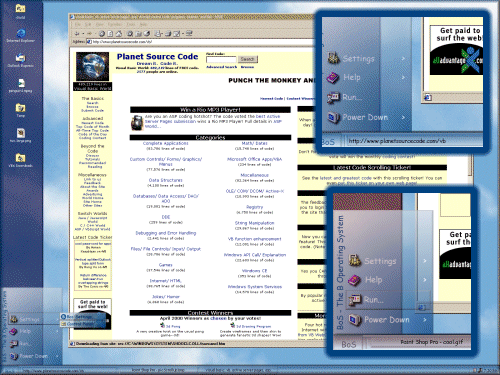



## BoS \- Replacement Shell \- Beta 2

### Description

BoS - Beta 2 Version - Now with a NEW green skin, an installation readme, a skin creation readme that describes how to make your OWN skins for BoS and bugfixes for lower screen resolutions.
 
### More Info
 

             |
---                |---
**Submitted On**   |2000-04-09 11:39:56
**By**             |[Brian](https://github.com/Planet-Source-Code/PSCIndex/blob/master/ByAuthor/brian.md)
**Level**          |Advanced
**User Rating**    |4.1 (73 globes from 18 users)
**Compatibility**  |VB 5\.0, VB 6\.0
**Category**       |[Complete Applications](https://github.com/Planet-Source-Code/PSCIndex/blob/master/ByCategory/complete-applications__1-27.md)
**World**          |[Visual Basic](https://github.com/Planet-Source-Code/PSCIndex/blob/master/ByWorld/visual-basic.md)
**Archive File**   |[CODE\_UPLOAD4646492000\.zip](https://github.com/Planet-Source-Code/brian-bos-replacement-shell-beta-2__1-7115/archive/master.zip)

